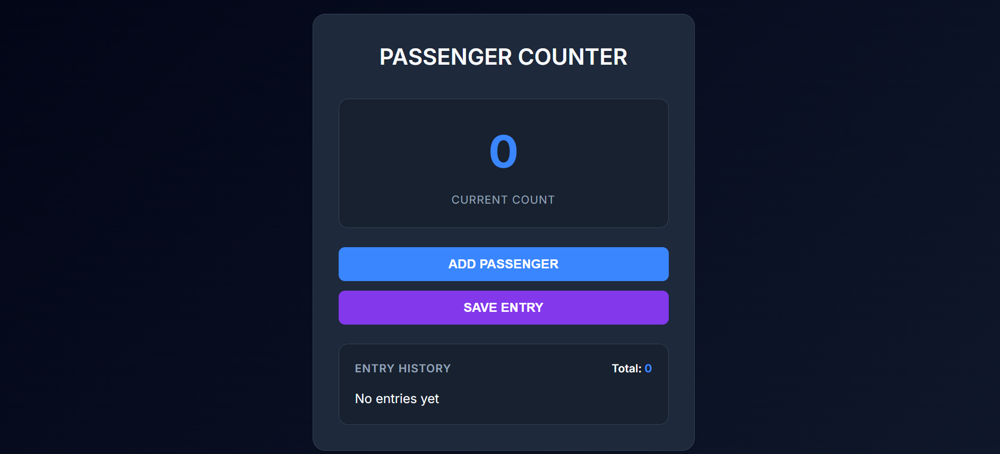

# 🧮 Passenger Counter App – Web3 UI Edition

A visually polished, futuristic passenger counter app featuring glassmorphism, dark gradients, smooth button animations, and clean layout. Built with pure HTML, CSS, and JavaScript — this project transforms a simple functionality into a beautiful Web3-style experience.

---

## ✨ Features

- 🌌 Web3-inspired dark gradient background
- 🧊 Glassmorphism UI container
- 📱 Fully responsive design (mobile & desktop)
- 🎨 Gradient hover effects + glowing buttons
- ⚙️ Vanilla JS for counter logic
- 🔗 External Unsplash background image

---

## 🚀 Technologies Used

- HTML5
- CSS3 (with gradients, glassmorphism, transitions)
- JavaScript (Vanilla)

---

## 📷 UI Preview

> A modern, glassy UI with responsive layout and glowing motion-inspired buttons.  
> Styled for Web3 portfolio or dashboard projects.

---

## 🛠️ How to Run

1. Clone the repository  
   `git clone https://github.com/yourusername/passenger-counter-app.git`

2. Open `index.html` in your browser.

---

## 🎯 Portfolio Use Case

This project is perfect to showcase:

- **Frontend UI design**
- **Vanilla JavaScript projects**
- **Responsive layouts**
- **Dark mode Web3-inspired design**

---

## 📸 Screenshot

---

## 📄 License

MIT License  
Feel free to use, modify, and share.
